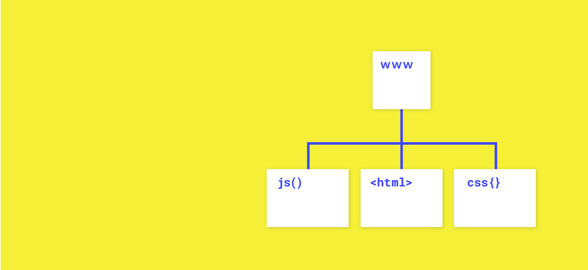

Javascript Tutorium WS 2018/2019 – HfG Schwäbisch Gmünd

## Basics of Javascript

**Javascript Tutorium 2018/2019 at the [Hochschule für Gestaltung Schwäbisch Gmünd](https://www.hfg-gmuend.de), November 2018.**

>JavaScript is one of the most popular programming languages in the world. Created more then 20 years ago, it was the first, and the only scripting language that was supported natively by web browsers. In the beginnings, it was not nearly as powerful as it is today, and it was mainly used for fancy animations.
> 
>With the growing needs that the web platform demands, JavaScript had the responsibility to grow as well, to accommodate the needs of one of the most widely used ecosystems of the world.
>
>JavaScript is now also the language powering databases and many more applications. It’s even possible to develop embedded applications, mobile apps, TV sets apps and much more. What started as a tiny language inside the browser is now the most popular language in the world.
>

**[→ Download Slides](Javascript_Tutorium_20181121.pdf)**

## Links / Quellen
List of Resources, which I think could be helpful. 

1. **Tutorials**  
	* [W3School](https://www.w3schools.com/)
	* [Codecademy](https://www.codecademy.com/)
	* [The Coding Train](https://www.youtube.com/channel/UCvjgXvBlbQiydffZU7m1_aw)
	* [Codepen](https://codepen.io/)
	* [Css Tutorium](http://tutorial.olivier-brueckner.de/) 
	
2. **Useful Links**
	* [Flat Color Guide](https://chrome.google.com/webstore/detail/flat-colors-guide/nienncdeogcamkahjjmaaipnojjokbok) – Chrome Plugin
	* [CSS Peeper](https://csspeeper.com/) – Best Chrome Plugin 

3. **javascript Libraries**
	* [jQuery](https://jquery.com/)
	* [Fuse.js](http://fusejs.io/) – Fuzzy Search Framework
	* [CSS Grid](http://learncssgrid.com)
	* [Annyang.js](https://www.talater.com/annyang/) – Voice Recognition Framework
	* [Scrollama](https://github.com/russellgoldenberg/scrollama) – Scrollama is a modern & lightweight JavaScript library for scrollytelling using IntersectionObserver in favor of scroll events.
	* ...

4. **Inspiration**
	They aren't only based on Javascript, some inspirations are scripted in css.
	* [swiss in CSS](https://swissincss.com/juni-festwochen-1959)
	* ...

5. **Topics & Tutorials**

* [HTML, CSS, DOM - p5.js #Basics #StartwithP5.js](https://www.youtube.com/watch?v=URSH0QpxKo8&index=1&list=PLRqwX-V7Uu6bI1SlcCRfLH79HZrFAtBvX)
* [Work with data – #API #JSON #CSV & more](https://www.youtube.com/watch?v=rJaXOFfwGVw&list=PLRqwX-V7Uu6a-SQiI4RtIwuOrLJGnel0r)
* [live video from a camera & pixel p5.js sketch](https://www.youtube.com/watch?v=bkGf4fEHKak&list=PLRqwX-V7Uu6aKKsDHZdDvN6oCJ2hRY_Ig)

**update 20181209 – Janis Walser
